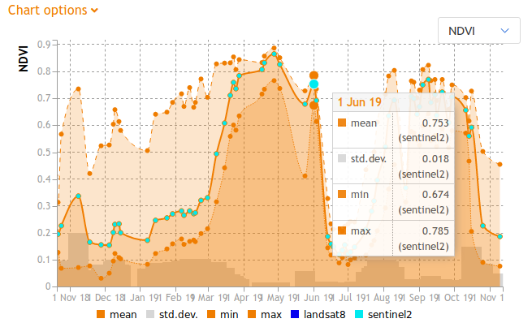
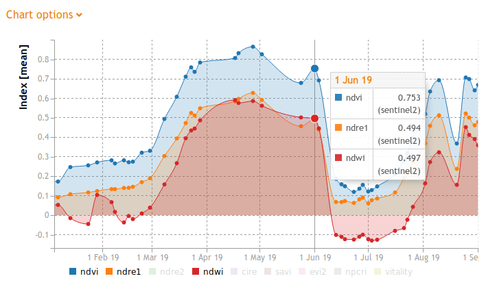
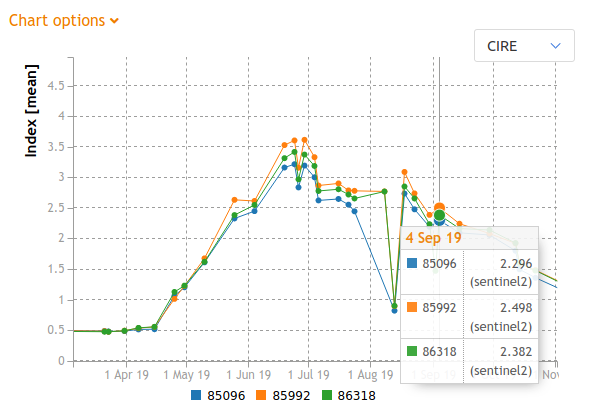

# gc-chart widget v2
## Description
gc-chart is an embeddable JavaScript/HTML widget for visualizing the outputs of the ag|knowledge REST API from [geocledian](https://www.geocledian.com).
It is built as a reusable [Vue.js](https://www.vuejs.org) component which allows the integration in [Vue.js](https://www.vuejs.org) applications smoothly. 
You may but you don't have to build the rest of the container application with [Vue.js](https://www.vuejs.org).

## Purpose
With this widget you are able to visualize the statistics of one or more parcels and products (NDVI, NDWI, etc.) from the REST API of ag|knowledge from geocledian.com.
> **Please note** that the widget contains a DEMO API Key and a DEMO parcel. If you want to visualize your data it has to be registered first in the REST API of ag|knowledge from geocledian.com. <br> Contact us for getting an API Key and registering your data.
The following modes are supported:
- visualizing all statistics graphs (min, max, mean, standard deviation) of one selectable remote sensing index of one parcel: "one-index"

- visualizing all mean graphs from all remote sensing indices of one parcel: "many-indices"

- visualizing mean graphs for a defined remote sensing index and a list of parcels: "many-parcels"


## Configuration
This widget is customizeable via HTML attributes and supports the setting of the following attributes.

### Basic options
- gc-apikey: API Key from geocledian, e.g. "39553fb7-7f6f-4945-9b84-a4c8745bdbec"; default: '39553fb7-7f6f-4945-9b84-a4c8745bdbec'
- gc-host: base host, e.g. "geocledian.com"; default: 'geocledian.com'
- gc-mode: choose from "one-index", "many-indices" or "many-parcel"; see above for details; default: "one-index"
- gc-selected-product: set selected product for the comparison of the parcels in the map, e.g. "$root.selectedProduct" or static e.g. "savi"; default: "" (empty)
- gc-data-source: current datasource, e.g. "$root.dataSource" (synchro from root) or static e.g. "sentinel2", "landsat8" or "" (all); default: "" (all)
- gc-query-date: date as simple ISO date string to compare the parcels for an index product, e.g. '2020-03-01' or "$root.queryDate"; default: ""
- gc-language: initial locale language for translation, e.g. "en" for english; default: "en"
  
### UI options
- gc-available-products: limit the available products, e.g. "ndvi,ndwi"; default: "vitality,ndvi,ndwi,ndre1,ndre2,savi,evi2,cire,npcri,sos,pos,eos"
- gc-available-options: limit the available options, e.g. "" for not title at all; default: "optionsTitle,graphType,hideGraphs,dateZoom,markers,legend"
- gc-available-stats: limit the available statistics for one-index mode, e.g. "min,max"; default: "min,max,mean,stddev"
- gc-options-collapsed: start the widget with options collapsed; default: "true"
- gc-datezoom-layout: "horizontal" or "vertical" layout for the date options; default: "vertical"

### Advanced options
#### Proxy mode / URL options
- gc-proxy: string which defines an alternative URL for sending the requests made by the widget instead of gc-host, e.g. "someproxy.someserver.com/app"; default: undefined

> __Note__: in proxy mode both gc-host and gc-api-key attributes are ignored and will not be sent to the given gc-proxy URL! It is assumed, that the Proxy will add the key parameter to the URL and sends the modified URL to the agknowledge service.

- gc-api-base-url: string for changing the base API URL for the agknowledge service; default: "/agknow/api/v3"
- gc-api-secure: boolean for specifying if HTTPS or HTTP shall be used sending the requests made by the widget;  default: true

#### Other
- gc-filter-string: filter string which may be defined externally; e.g. "&crop=bla"; default: ""
- gc-offset: offset in request which may be defined externally; e.g. 1000; default: 0
- gc-limit: limit of total parcels per request which may be defined externally; e.g. 100; default: 250
- gc-parcels: array of parcel objects; may be passed externally or loaded by the widget itself; default: []
- gc-current-parcel-id: used to highlight a parcel in the chart; may be set externally - only for mode "one-index" or "many-indices"; default: -1
- gc-visible-parcel-ids: array of parcel ids, which contain the parcel ids for visualizing only this subset in the chart - not all from parcels array, e.g. "$root.selectedParcelIds"; default: []
- gc-zoom-startdate: startdate as simple ISO date string for zooming into the chart, e.g. '2020-04-01'; default: ""
- gc-zoom-enddate: enddate as simple ISO date string for zooming into the chart, e.g. '2020-11-01'; default: ""
- gc-initial-loading: loads the parcels within this map component itself; if set to false the widget waits for gc-parcels to be set; default: "true"

>Note: As there are defaults you will only have to set an attribute to change the default internal value.


## Integration
For the integration of the widget you'll have to follow three steps.

You have to add some dependencies in the head tag of the container website.

```html
<html>
  <head>

    <!--GC chart component begin -->

    <!-- loads also dependent css files via @import -->
    <link href="css/gc-chart.css" rel="stylesheet">
    <!-- init script for components -->
    <script src="js/gc-chart-init.js"></script> 

    <!--GC chart component end -->
  </head>

```

Then you may create the widget(s) with custom HTML tags anywhere in the body section of the website. Make sure to use an unique identifier for each chart component (chartid).

>If you want to change the id of the parent div ("gc-app") you'll have to change this divs' id also in the init script `gc-chart-init.js`, method `initComponent()`.


```html
<div id="gc-app">
  <gc-chart chartid="chart1" 
            gc-apikey="39553fb7-7f6f-4945-9b84-a4c8745bdbec" 
            gc-host="geocledian.com" 
            gc-parcel-id="4483"
            mode="one-index">
  </gc-chart>
  <gc-chart chartid="chart2" 
            gc-apikey="39553fb7-7f6f-4945-9b84-a4c8745bdbec" 
            gc-host="geocledian.com" 
            gc-parcel-id="4483"
            mode="many-indices">
  </gc-chart>
  <gc-chart chartid="chart3" 
            gc-apikey="39553fb7-7f6f-4945-9b84-a4c8745bdbec" 
            gc-host="geocledian.com" 
            gc-parcel-ids="4483,4486"
            mode="many-parcels">
  </gc-chart>
</div>
```


## Support
Please contact [us](mailto:info@geocledian.com) from geocledian.com if you have troubles using the widget!

## Used Libraries
- [Vue.js](https://www.vuejs.org)
- [Vue I18n](https://kazupon.github.io/vue-i18n/)
- [c3.js](https://c3js.org/)

## Legal: Terms of use from third party data providers
- You have to add the copyright information of the used data. At the time of writing the following text has to be visible for [Landsat](https://www.usgs.gov/information-policies-and-instructions/crediting-usgs) and [Sentinel](https://scihub.copernicus.eu/twiki/pub/SciHubWebPortal/TermsConditions/TC_Sentinel_Data_31072014.pdf) data:

```html
 contains Copernicus data 2020.
 U.S. Geological Service Landsat 8 used in compiling this information.
```

**geocledian is not responsible for illegal use of third party services.**